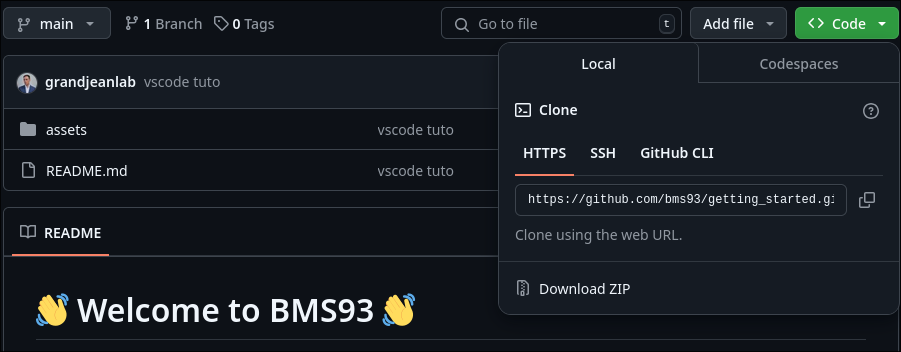
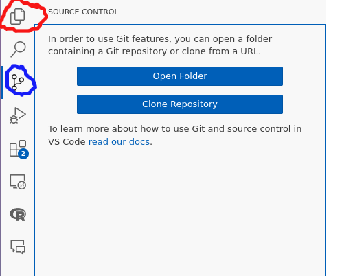
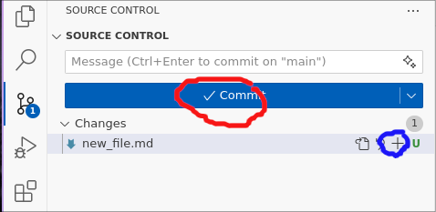
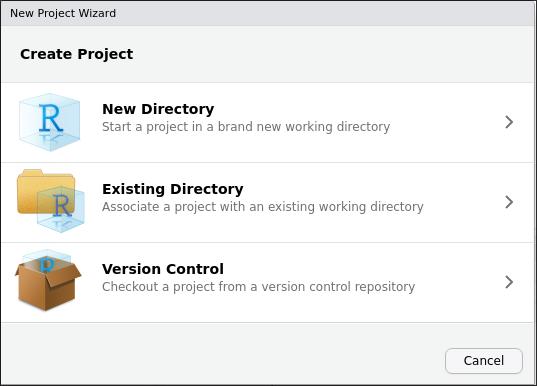
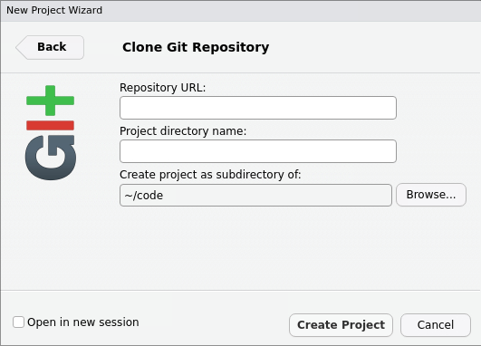
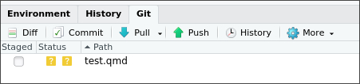
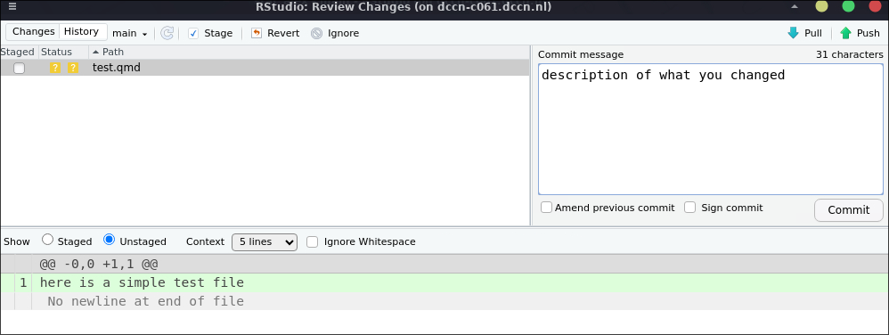

# :wave: Welcome to BMS93 :wave: 

This document aggregates key resources and *how-to* guides to get you started.

## The end goal: You can carry out an open and reproducible analysis.
The aim of BMS93 is to prepare the students to carry out reproducible research, a pilar of the open science movement. Here, we focus on declarative analysis using scripting code (Python, R) and version control (Git/Github). We will use the Quarto document format to blend in code and text to capture the thought processes during the analysis and render figures.

## You set your learning goals. 
At the end of the course, you can import a dataset into Python or R, extract characteristics out of it, test hypothesis on it using statistical inference, and make clear plots to support your claims. Beyond that, you set your own goals and your own pace. You are assigned a tutor with whom you can discuss your progress and next steps. 

## Your assesment. 
You are assessed at two moments. 

1. You are assessed on your ability to present clearly the outcome of an analysis that you carried on a [dataset](https:/github.com/orgs/bms93/datasets) of your choice.   

| Category | Deficient; can be compensated. 1 point | Sufficient/Good. 2 points | Exemplary. 3 points |
|---|---|---|---|
| Understanding of the data | The student can poorly describe the content of the dataset or formulate a question. Poor presentation skills. | The student gives a succint introduction of the dataset. The research question is sound. Good presentation skills. | The student can put the dataset into its context, when needed, interpolate missing data. The research question is clear and well thought through. Excellent presentation skills. |
| Graphics and analysis | The supporting graphics/analysis is insufficent to address the research question. Graphics a minimalistic or not adapted. | The supporting graphics/analysis can mostly cover the research question. The student uses adapted plots for their data. The statistics is sound. | The supporting graphics/analysis support the research question. Great attention has been put into the plots. The statistics is correct, and when applicable, the assumptions of the test seem correct. |
| Reflexion and discussion | The student cannot answer basic questions about their analysis | The student can reflect on their analsysis. | The student can reflect critically on their analysis and propose follow up solutions. |

2. Your code notebook is assessed for legiblity and potential for reproducibility. 

| Category | Deficient; can be compensated. 1 point | Sufficient/Good. 2 points | Exemplary. 3 points |
|---|---|---|---|
| Organization | No discussion of the code/results. Unrelated code chuncks left over in the notebook.  | Easy to navigate notebook. Results are discussed with text between code chunks.. The document is rendered correctly | The analysis is divided into clear sections. The discussion of the results is clear.  |
| Potential for reproducibility | Not clear how to set the environement. Code chunks not in order | Code is clear. You should be able to run it on your machine with minimal tweaks | Code is super clear. Instructions for package installations (and version). Path are relative, or used together with a variable that the user can adjust to their needs |
| Soundness of analysis  | The student makes questionable analytical decision | The analysis is sound. Good use of the tools and packages.  | The student goes above and beyond. Find new and exciting tools to address their needs |

3. Additionally, get get points removed for not updating your weekly progress report.  

| The student did not show noticeable progress during the course. Minimal git presence. Incomplete report | The student set reasonable goals and achieved them. Good use of git in the report. Well enough detailed goals. | The student outperform expectations based on their original levels. Excellent use of git. Set clear goals and report on them. |
|---|---|---|
| -0.5 points | no changes | +0.5 points |

## Example studies to inspire you to write reproducible notebook.
Study: https://pubmed.ncbi.nlm.nih.gov/34650202/   
Code: https://gitlab.socsci.ru.nl/preclinical-neuroimaging/insula   
Language: R

Study: https://pubmed.ncbi.nlm.nih.gov/36973511/   
Preregistration: https://osf.io/emq4b   
Code: https://github.com/grandjeanlab/MultiRat   
Language: Python

Ongoing study: Galteau et al. Activation mapping in multi-center rat sensory-evoked functional MRI datasets using a unified pipeline.   
Preregistration: https://osf.io/8vy9r
Code: https://github.com/grandjeanlab/multirat_se   
Language: Python

## Technical issues with the course? 
No problem. To get you used to the motion of GitHub (see below), we ask you to fill in your technical issues in a centralized place. 
**[https://github.com/bms93/issues](https://github.com/bms93/issues)**
We will not address issues submitted by emails past the first week. 

## Quick note on AI. 
Use it at your own risk. It helps with coding. But it cannot replace thinking and problem-solving. Learning (with your brain and google) how to troubleshoot coding issues can get you out of issues that AI cannot. Using your brain can also give you a sense of satisfaction. In the end, you are assessed for the work done and your understanding. Use AI wisely. 

## What is Gitub?
We use Github classrooms to distribute tutorials and assignment. Github is a popular system to host code and work collaboratively. Github interacts with your computer via Git, a version control system. In BMS93, we expect you to learn and become familiar with the basics of Git and Github. Github provides a tutorial to get started, which you can access through the link on brightspace. These will automatically create your own repositories for you to work on in Github.

You can see your own BMS93 Github repositories by going to [https://github.com/orgs/bms93/repositories](https://github.com/orgs/bms93/repositories). This is important, because this is what the tutors see from your work (not the material on your computer). Make sure to regularly update (commit and push) your progresses on Github. We cannot assess work that is not on Github. 

Github contains repositories, which is where code is stored and shared. You can `clone` a repository to your computer by using an *https* URL. You can get the URL from the Github page of the repository. You can get 'https', 'ssh' and 'git' URLs. We recommend using 'https' for beginners.

Github and git have basic motions which you can learn in the interactive tutorial (see link on brightspace).   
1. **'Clone'** downloads the files contained in a repository from Github to your computer. (command line: `git clone URL`)   
2. **'Commit'** saves changes to files to the repository on your computer. (command line: `git commit -m "description of changes"`)   
3. **'Push'** uploads changes to the repository on Github. (command line: `git push`)   
4. **'Pull'** downloads changes from the repository on Github to your computer. (command line: `git pull`)   

There are a few more motions. You can learn more about them in the interactive tutorial, e.g., `pull request` and `issues`.   
You can also see the history of this repository by clicking on the 'commits' tab. You get a sense of what is added by reading my commit messages.   

You can also read more about it in MIT's [missing semester](https://missing.csail.mit.edu/2020/version-control/).

## Interfacing with Git/Github on your computer. 

- You can download the Git client from [here](https://git-scm.com/downloads).   
This lets you use the Git command line interface (CLI) to interact with Github.   

- Interactive Development Environments (IDE) like VSCode and RStudio have integrated Git support. You can use these to interact with Github from a graphical user interface (GUI). For beguiners, this is a good way to get started. They will let your perform `clone`, `commit`, `push` and `pull` easily. See the sections below for screenshots and instructions on how to use Git in these IDEs.   

- There is also a Git Desktop client where you can manage your Git workflow using a GUI outside VSCode or RStudio.   

- git needs to be configured. In Windows, open "command prompt", in MacOS open the terminal app, and type the two following commands in the terminal:   
`git config --global user.name "John Doe"`   
`git config --global user.email johndoe@example.com`    
remember to change the name and email to yours.    

## Python
Python is a general purpose programming language that is widely used in data science. It is largely popular in part, due to its excellent support for Machine Learning and AI applications.   

Refer to task-1 which you can find under https://github.com/bms93/py-intro-YOURUSERNAME (after you activated the link on brighspace) for details about the installation and setup.  

- MacOS should already come with Python pre-installed. You can test this by opening the *Terminal* app on your MacOS and typing `python` + <Enter> to open a python session.   
- Windows usesr may need to install Python. You can download Python from [here](https://www.python.org/downloads/). Make sure you tick the box "Add Python X.X to PATH"!!!. See picture below.      
- Python is a barebone scripting language. In most projects, users add packages to add functionality (e.g. Pandas to work with tables). Here, we will use the virtual environements (`.venv`) framework and `pip` to install python packages. Learn about VSCode intergration of virtual environements [here](https://code.visualstudio.com/docs/python/environments).  
- We recommend usig VScode as an IDE for Python. You can download VScode from [here](https://code.visualstudio.com/download). (Rstudio will also work, setup at your own risks)   
- In VS code, you will need to download the Python, Jupyter, and Quarto extensions. (ctrl+shift+x to open the extension panel in VSCode, search for Python, Jupyter, and Quarto, click install).   

## R
R is a programming language that is best in class for statistical analysis and data visualization.   

Refer to task-1 which you can find under https://github.com/bms93/r-intro-YOURUSERNAME (after you activated the link on brighspace) for details about the installation and setup. 

- You can download R from [here](https://cran.r-project.org/).   
- We recommend using RStudio as an IDE for R. You can download RStudio from [here](https://rstudio.com/products/rstudio/download/). (VS code will also work, setup at your own risks)   
- R functions are added by installing packages. Package installation is managed within RStudio or can be achieved from the command line with `install.packages('name-of-your-package')`   

## Quarto
[Quarto](https://quarto.org/) is a new document format that allows you to write documents in [markdown](https://www.markdownguide.org/) and render them to PDF, HTML, Word, and other formats. Quarto notebooks let you mix code blocks with markdown text, which is great for writing reports interleaved with your thought process during the analysis. We will use quarto (.qmd) files for assignments in BMS93. Quarto works with Python and R and aims to replace Jupyter (mostly python) and Rmarkdown (mostly R) notebook formats. For note, this document is written in markdown (see the .md extension).   

- It comes pre-intralled with RStudio.   
- If you use VSCode, you can download Quarto from [here](https://quarto.org/docs/getting-started/installation.html).   

### ***Important***. Quarto can render documents in many formats. This is defined in your '.qmd' file header under `format:`. Please use the **format: gfm** for all your documents in BMS93. This will render the document in a format that is easy to read on Github. We will not assess documents in other formats!`   

## Getting started with Git in VSCode
1. Open VSCode and click on the source control icon on the left-hand side of the screen. (shortcut ctl+shift+g, blue highlight)   

2. Click on the 'Clone Repository' button.   
3. Enter the URL of the repository you want to clone. You can get this from the Github page of the repository. e.g. https://github.com/bms93/git-YOURUSERNAME.git if you follow the 'git' tutorial on brightspace.   
4. You may need to input Github username and password.   
5. Choose a location on your computer to save the repository.   
6. You can now see the files in the repository in the file explorer (shortcut ctl+shift+e, red highlight).   
7. Select the files you want to edit and get started!   
8. The first time you start working on a python project, you will want to set a python virtual environements. With the VSCode python extension installed (`Ctl + Shift + x` to open the extension panel), you can create virtual environements by opening the command panel with `Ctl + Shift + p`, and type `Python: Create Environments`, selecting `venv`, and the python interpreter (if you only have one version of python installed, only one will show up).  
9. When you are done editing, go back to source control. You will see the files you have changed. Click on '+' to stage the changes. Add a 'commit message' detailing briefly the changes, then click on 'commit' to save the changes locally.   

10. To push the changes to Github, click on the three dots (...) and select 'push'. You may need to input your Github username and password.   
11. You can now see the changes on the Github page of the repository, so can your tutors!! Yay.   

## Getting started with Git in RStudio
1. Open RStudio and click on the 'File'/'New Project' menu.   
2. Choose 'Version Control' and then 'Git'.    

3. Enter the URL of the repository you want to clone. You can get this from the Github page of the repository. e.g. https://github.com/bms93/git-YOURUSERNAME.git if you follow the 'git' tutorial on brightspace.   

4. You may need to input Github username and password.   
5. Choose a location on your computer to save the repository.   
6. You can now see the files in the repository in the file explorer.   
7. Select the files you want to edit and get started!   
8. When you are done editing, go back to the 'Git' tab. You will see the files you have changed. Click on 'commit'. Add a 'commit message' detailing briefly the changes, then click on 'commit' to save the changes locally.   

9. To push the changes to Github, click on 'push'. You may need to input your Github username and password.   

10. You can now see the changes on the Github page of the repository, so can your tutors!! Yay.   

## What to do now? 
Follow the links on Brightspace to follow the Git, and Python or R tutorials. Once you are done with these and confident with your skills, clone the assignment repository, pick a dataset, a research question, and start working on your analysis. 
