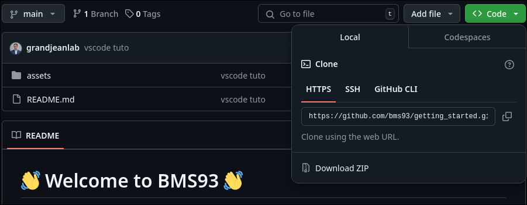
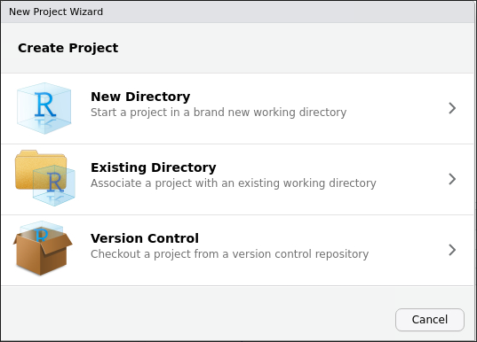
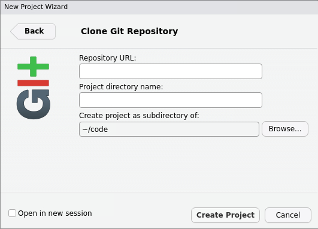
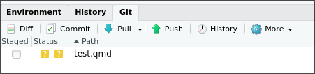
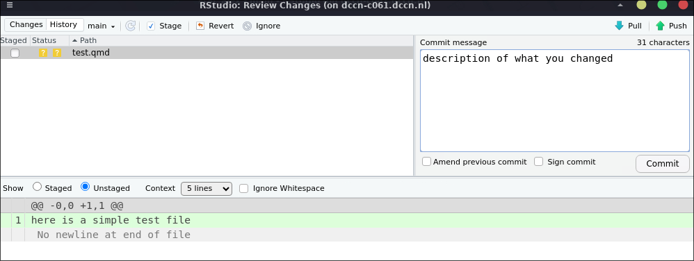

# :wave: Welcome to BMS93 :wave: 

This document aggregates key resources and *how-to* guides to get started.

## The end goal: reproducible analysis
The aim of BMS93 is to prepare the students to carry out reproducible research. Here, we focus on declarative analysis using scripting code (Python, R) and version control (Git/Github). We will use the Quarto document format to blend in code and text to capture the thought processes during the analysis and render figures.

## Example studies from the Grandjean lab to inspire you
Study: https://pubmed.ncbi.nlm.nih.gov/34650202/
Code: https://gitlab.socsci.ru.nl/preclinical-neuroimaging/insula

Study: https://pubmed.ncbi.nlm.nih.gov/36973511/
Preregistration: https://osf.io/emq4b
Code: https://github.com/grandjeanlab/MultiRat

Ongoing study: Galteau et al. Activation mapping in multi-center rat sensory-evoked functional MRI datasets using a unified pipeline. 
Preregistration: https://osf.io/8vy9r
Code: https://github.com/grandjeanlab/multirat_se

## Gitub
We use Github classrooms to distribute tutorials and assignment. Github is a popular system to host code and work collaboratively. Github interacts with your computer via Git, a version control system. In BMS93, we expect you to learn and become familiar with the basics of Git and Github. Github provides a tutorial to get started, which you can access through the link on brightspace.

Github contains repositories, which is where code is stored and shared. You can 'clone' a repository to your computer by using an https URL. You can get the URL from the Github page of the repository. You can get 'https', 'ssh' and 'git' URLs. We recommend using 'https' for beginners.

Github and git have basic motions which you can learn in the interactive tutorial (see link on brightspace).   
1. **'Clone'** downloads a repository from Github to your computer. (command line: `git clone URL`)
2. **'Commit'** saves changes to the repository on your computer. (command line: `git commit -m "description of changes"`)
3. **'Push'** uploads changes to the repository on Github. (command line: `git push`)
4. **'Pull'** downloads changes from the repository on Github to your computer. (command line: `git pull`)

There are a few more motions. You can learn more about them in the interactive tutorial, e.g., 'pull request'and 'issues'.

## Interfacing with Git/Github on your computer. 

- You can download the Git client from [here](https://git-scm.com/downloads).
This lets you use the Git command line interface (CLI) to interact with Github.

- Interactive Development Environments (IDE) like VSCode and RStudio have integrated Git support. You can use these to interact with Github from a graphical user interface (GUI). For beguiners, this is a good way to get started. They will let your perform 'clone', 'commit', 'push' and 'pull' easily. See the sections below for screenshots and instructions on how to use Git in these IDEs.

## Python
Python is a general purpose programming language that is widely used in data science. It is largely popular in part, due to its excellent support for Machine Learning and AI applications.

- You can download Python from [here](https://www.python.org/downloads/).
- We recommend using the Anaconda distribution of Python to manage your python environement. You can download Anaconda from [here](https://www.anaconda.com/download/success).
- We recommend usig VScode as an IDE for Python. You can download VScode from [here](https://code.visualstudio.com/download). (Rstudio will also work)
- In VS code, download the Python and Quarto extensions. (ctrl+shift+x, search for Python and Quarto, click install).

## R
R is a programming language that is best in class for statistical analysis and data visualization. 

- You can download R from [here](https://cran.r-project.org/).
- We recommend using RStudio as an IDE for R. You can download RStudio from [here](https://rstudio.com/products/rstudio/download/). (VS code will also work)

## Quarto
[Quarto](https://quarto.org/) is a new document format that allows you to write documents in [markdown](https://www.markdownguide.org/) and render them to PDF, HTML, and other formats. Quarto notebooks let you mix code blocks with markdown text, which is great for writing reports interleaved with your thought process during the analysis. We will use quarto (.qmd) files for assignments in BMS93. Quarto works with Python and R and aims to replace Jupyter (mostly python) and Rmarkdown (mostly R) notebook formats.

- You can download Quarto from [here](https://quarto.org/docs/getting-started/installation.html).

## Getting started with Git in VSCode
1. Open VSCode and click on the source control icon on the left-hand side of the screen. (shortcut ctl+shift+g, blue highlight)   

2. Click on the 'Clone Repository' button. 
3. Enter the URL of the repository you want to clone. You can get this from the Github page of the repository. e.g. https://github.com/bms93/github-intro-YOURUSERNAME
4. You may need to input Github username and password.
5. Choose a location on your computer to save the repository.
6. You can now see the files in the repository in the file explorer (shortcut ctl+shift+e, red highlight).
7. Select the files you want to edit and get started!
8. When you are done editing, go back to source control. You will see the files you have changed. Click on '+' to stage the changes. Add a 'commit message' detailing briefly the changes, then click on 'commit' to save the changes locally.   

9. To push the changes to Github, click on the three dots (...) and select 'push'. You may need to input your Github username and password.
10. You can now see the changes on the Github page of the repository, so can your tutors!! Yay. 

## Getting started with Git in RStudio
1. Open RStudio and click on the 'File'/'New Project' menu.
2. Choose 'Version Control' and then 'Git'.   

3. Enter the URL of the repository you want to clone. You can get this from the Github page of the repository. e.g. https://github.com/bms93/github-intro-YOURUSERNAME    

4. You may need to input Github username and password.
5. Choose a location on your computer to save the repository.
6. You can now see the files in the repository in the file explorer.
7. Select the files you want to edit and get started!
8. When you are done editing, go back to the 'Git' tab. You will see the files you have changed. Click on 'commit'. Add a 'commit message' detailing briefly the changes, then click on 'commit' to save the changes locally.

9. To push the changes to Github, click on 'push'. You may need to input your Github username and password.

10. You can now see the changes on the Github page of the repository, so can your tutors!! Yay.

